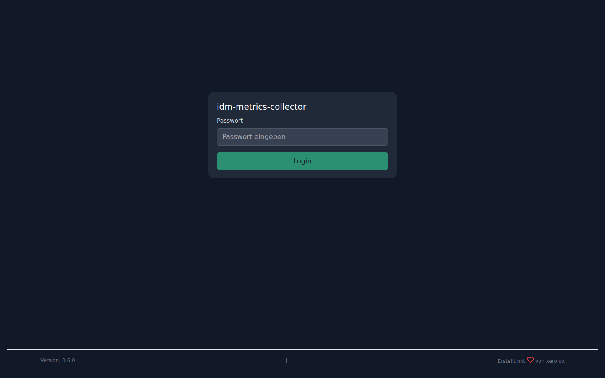
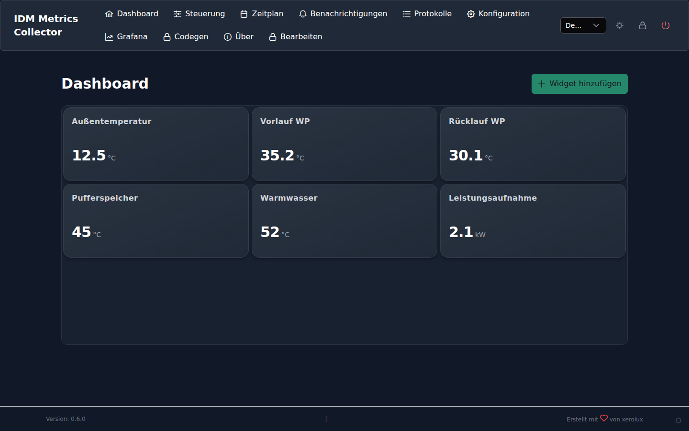
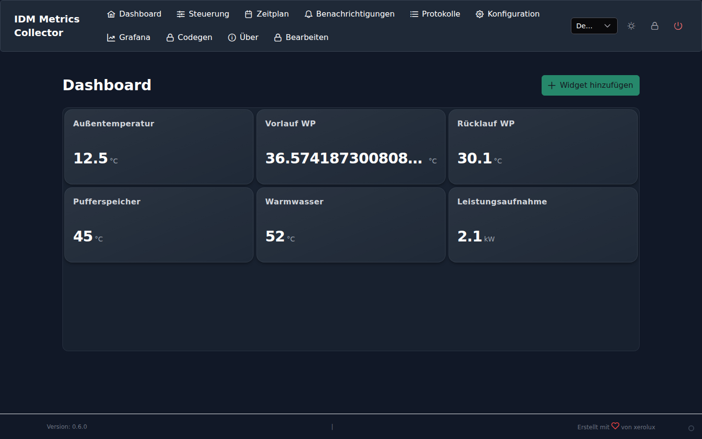

# IDM Metrics Collector - Benutzerhandbuch

Willkommen beim offiziellen Handbuch für den IDM Metrics Collector. Diese Dokumentation führt Sie durch die Installation, Konfiguration und Nutzung der Software.

---

## Inhaltsverzeichnis

1. [Einleitung](#1-einleitung)
2. [Voraussetzungen](#2-voraussetzungen)
3. [Installation](#3-installation)
4. [Ersteinrichtung](#4-ersteinrichtung)
5. [Die Benutzeroberfläche](#5-die-benutzeroberfläche)
    - [Login](#login)
    - [Dashboard](#dashboard)
    - [Steuerung (Control)](#steuerung-control)
    - [Zeitpläne (Schedule)](#zeitpläne-schedule)
    - [Benachrichtigungen (Alerts)](#benachrichtigungen-alerts)
    - [Einstellungen (Config)](#einstellungen-config)
    - [Logs & Tools](#logs--tools)
6. [Erweiterte Konfiguration](#6-erweiterte-konfiguration)
7. [Fehlerbehebung](#7-fehlerbehebung)

---

## 1. Einleitung

Der IDM Metrics Collector ist eine leistungsstarke Softwarelösung, um Ihre IDM Wärmepumpe (Navigator 2.0) in das digitale Zeitalter zu holen. Er verbindet sich über die Modbus TCP Schnittstelle mit Ihrer Heizung und bietet:

*   **Echtzeit-Überwachung:** Sehen Sie sofort, was Ihre Heizung macht.
*   **Langzeit-Analyse:** Speicherung aller relevanten Daten in einer VictoriaMetrics Datenbank und Visualisierung via Grafana.
*   **Intelligente Steuerung:** Automatisieren Sie Heizkreise und Warmwasserbereitung.
*   **KI-gestützte Fehlererkennung:** Anomalie-Erkennung warnt vor ungewöhnlichem Verhalten.

---

## 2. Voraussetzungen

Um den IDM Metrics Collector nutzen zu können, benötigen Sie:

1.  **IDM Wärmepumpe** mit Navigator 2.0 Steuerung.
2.  **Netzwerkverbindung** (LAN) zur Wärmepumpe.
    *   *Hinweis:* Modbus TCP muss in den Einstellungen der Wärmepumpe aktiviert sein.
3.  Einen **Server** (z.B. Raspberry Pi, Synology NAS, Mini-PC), auf dem **Docker** und **Docker Compose** installiert sind.

---

## 3. Installation

Die Installation erfolgt über Docker Compose. Dies garantiert eine isolierte und stabile Umgebung.

### Schritt 1: Repository klonen
Laden Sie den Quellcode auf Ihren Server herunter:
```bash
git clone https://github.com/Xerolux/idm-metrics-collector.git
cd idm-metrics-collector
```

### Schritt 2: Container starten
Starten Sie die Anwendung. Docker lädt automatisch alle notwendigen Komponenten herunter.
```bash
docker compose up -d
```

Nach wenigen Augenblicken sind folgende Dienste erreichbar:
*   **Web-Interface:** `http://<server-ip>:5008`
*   **Grafana:** `http://<server-ip>:3000` (Login: `admin` / `admin`)

---

## 4. Ersteinrichtung

Beim ersten Aufruf der Web-Oberfläche (`http://<server-ip>:5008`) begrüßt Sie der Einrichtungs-Assistent.


1.  **IDM Wärmepumpe:**
    *   **Host IP:** Geben Sie die lokale IP-Adresse Ihrer Wärmepumpe ein (z.B. `192.168.1.50`).
    *   **Modbus Port:** Standard ist `502`.
2.  **Aktivierte Features:**
    *   Wählen Sie die Heizkreise aus, die physisch vorhanden sind (A, B, C...).
    *   Aktivieren Sie ggf. Zonenmodule, falls verbaut.
3.  **VictoriaMetrics:**
    *   Hier können Sie die URL zur Datenbank anpassen. Im Standard Docker-Setup belassen Sie dies auf `http://victoriametrics:8428/write`.
4.  **Admin Sicherheit:**
    *   Vergeben Sie ein *sicheres* Admin-Passwort. Dies ist der Zugang für die Web-Oberfläche.

Klicken Sie auf **Einrichtung abschließen**.

---

## 5. Die Benutzeroberfläche

Nach der Einrichtung gelangen Sie zum Login.

### Login

Melden Sie sich mit dem Benutzer `admin` und Ihrem gewählten Passwort an.



### Dashboard

Das Herzstück der Anwendung. Hier sehen Sie alle wichtigen Parameter auf einen Blick.



*   **Temperaturen:** Außentemperatur, Vorlauf, Rücklauf, Speicher oben/unten.
*   **Status-Icons:**
    *   Fire *Heizen:* Wärmepumpe erzeugt Wärme.
    *   Water *Warmwasser:* Warmwasserbereitung läuft.
    *   Snow *Kühlen:* Kühlbetrieb aktiv.
    *   Warning *Fehler:* Ein Fehlercode liegt vor.
*   **Leistung:** Aktuelle Stromaufnahme (falls verfügbar).

### Steuerung (Control)

Hier können Sie aktiv in die Regelung eingreifen.



*   **Betriebsmodus:** Stellen Sie den globalen Modus um (Heizen, Kühlen, Auto, Eco).
*   **Soll-Temperaturen:** Ändern Sie die gewünschte Raumtemperatur pro Heizkreis.
*   **Sofort-Aktionen:** Starten Sie eine einmalige Warmwasserladung ("1x Warmwasser").

### Zeitpläne (Schedule)

Erstellen Sie Wochenpläne für Heizung und Warmwasser.


*   Ziehen Sie Zeitblöcke einfach mit der Maus.
*   Definieren Sie unterschiedliche Profile (z.B. "Urlaub", "Party").

### Benachrichtigungen (Alerts)

Hier sehen Sie den Status der KI-Überwachung und Systemmeldungen.


*   **Anomalie-Score:** Zeigt an, wie "normal" sich die Anlage verhält.
*   **Letzte Meldungen:** Liste der erkannten Ereignisse.

### Einstellungen (Config)

Hier verwalten Sie die Systemeinstellungen.


*   **Backup:** Konfigurieren Sie automatische Backups (Lokal oder WebDAV).
*   **Updates:** Prüfen Sie auf Software-Updates.
*   **Netzwerk:** Ändern Sie die IP der Wärmepumpe nachträglich.

> **Sicherheitshinweis:** In der Oberfläche werden Passwörter und Tokens automatisch unkenntlich gemacht (verpixelt), um Ihre Sicherheit bei Screenshots zu gewährleisten.

### Logs & Tools

Für fortgeschrittene Diagnose.

*   **Logs:** Zeigt die Rohdaten der Kommunikation zwischen Container und Wärmepumpe.
*   **Tools:** Generieren Sie Service-Codes für das Navigator-Panel am Gerät selbst.


---

## 6. Erweiterte Konfiguration

### Grafana Dashboards

Grafana bietet tiefe Einblicke in die Historie. Standardmäßig ist ein Dashboard "IDM Heatpump" vorinstalliert.
Sie können eigene Dashboards erstellen oder das bestehende anpassen. Die Datenquelle ist "VictoriaMetrics".

### Backup & Restore

Das System erstellt täglich ein Backup der Konfiguration und Datenbank.
*   **Wiederherstellung:** Um ein Backup wiederherzustellen, kopieren Sie die Backup-Datei in den `backups/` Ordner und starten Sie den Restore-Prozess über die Konsole oder (in Zukunft) über das Web-Menü.

---

## 7. Fehlerbehebung

**Ich sehe keine Daten im Dashboard.**
1.  Prüfen Sie die IP-Adresse der Wärmepumpe in den Einstellungen.
2.  Stellen Sie sicher, dass Modbus TCP an der IDM Anlage aktiviert ist (Fachmannebene).
3.  Prüfen Sie die Logs unter "Logs" auf Verbindungsfehler.

**Login funktioniert nicht mehr.**
Wenn Sie Ihr Passwort vergessen haben, müssen Sie die Datei `data/config/config.json` (oder ähnlich, je nach Version) manuell bearbeiten oder den Container neu aufsetzen (Achtung: Datenverlust ohne Backup).

**Grafiken in Grafana sind leer.**
Prüfen Sie, ob der `victoriametrics` Container läuft: `docker compose ps`.

---

*Copyright © 2024 IDM Metrics Collector Team.*
